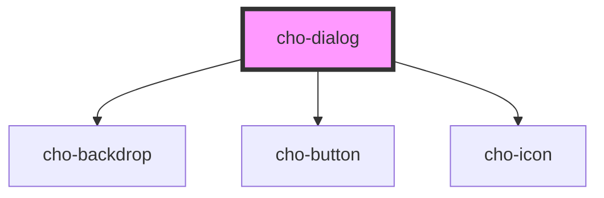

# cho-dialog

<!-- Auto Generated Below -->

## Properties

| Property      | Attribute     | Description                                                     | Type      | Default |
| ------------- | ------------- | --------------------------------------------------------------- | --------- | ------- |
| `dismissible` | `dismissible` | If `true`, the dialog will close when clicking on the backdrop. | `boolean` | `true`  |
| `visible`     | `visible`     | If `true`, the dialog will be visible.                          | `boolean` | `false` |

## Slots

| Slot       | Description                     |
| ---------- | ------------------------------- |
|            | The main content of the dialog. |
| `"footer"` | The footer of the dialog.       |
| `"title"`  | The title of the dialog.        |

## Dependencies

### Depends on

- [cho-backdrop](../backdrop)
- [cho-button](../button)
- [cho-icon](../icon)

### Graph

----------------------------------------------

*Built with [StencilJS](https://stenciljs.com/)*
