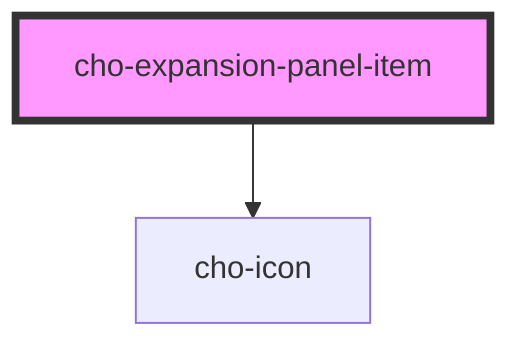

# cho-expansion-panel-item

<!-- Auto Generated Below -->

## Properties

| Property   | Attribute  | Description                                           | Type      | Default |
| ---------- | ---------- | ----------------------------------------------------- | --------- | ------- |
| `disabled` | `disabled` | If `true`, the expansion-panel-item will be disabled. | `boolean` | `false` |
| `visible`  | `visible`  | If `true`, the content will be visible.               | `boolean` | `false` |

## Events

| Event                         | Description                                              | Type                                                   |
| ----------------------------- | -------------------------------------------------------- | ------------------------------------------------------ |
| `expansionPanelItemConnected` | Called every time the component is connected to the DOM. | `CustomEvent<IExpansionPanelItemConnectedDetail>`      |
| `visibleChanged`              | Callback fired when the visible is changed.              | `CustomEvent<IExpansionPanelItemVisibleChangedDetail>` |

## Slots

| Slot            | Description                                                                                                           |
| --------------- | --------------------------------------------------------------------------------------------------------------------- |
| `"content"`     | A component to display the content of the expansion panel.                                                            |
| `"expand-icon"` | A component to display the expand icon of the expansion panel (defaults to an icon of kind 'arrow-down', 'arrow-up'). |
| `"title"`       | A component to display the title of the expansion panel.                                                              |

## Dependencies

### Depends on

- [cho-icon](../icon)

### Graph

----------------------------------------------

*Built with [StencilJS](https://stenciljs.com/)*
