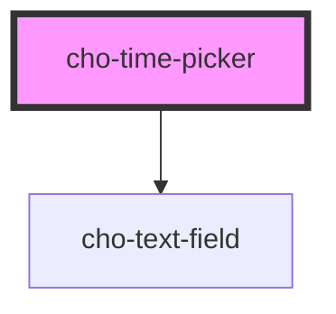

# cho-time-picker

## Examples

<cho-time-picker>
</cho-time-picker>

```html
<cho-time-picker>
</cho-time-picker>
```

<!-- Auto Generated Below -->


## Properties

| Property           | Attribute            | Description                                        | Type      | Default      |
| ------------------ | -------------------- | -------------------------------------------------- | --------- | ------------ |
| `disabled`         | `disabled`           | If `true`, the text-field will be disabled.        | `boolean` | `false`      |
| `twelveHourFormat` | `twelve-hour-format` | If `true`, the value will be formatted with AM/PM. | `boolean` | `false`      |
| `value`            | --                   | The value of the time-picker.                      | `Date`    | `new Date()` |
| `visible`          | `visible`            | If `true`, the time will be visible.               | `boolean` | `false`      |


## Events

| Event            | Description                                       | Type                                           |
| ---------------- | ------------------------------------------------- | ---------------------------------------------- |
| `hoursChanged`   | Callback fired when the hours value is changed.   | `CustomEvent<ITimePickerHoursChangedDetail>`   |
| `minutesChanged` | Callback fired when the minutes value is changed. | `CustomEvent<ITimePickerMinutesChangedDetail>` |
| `valueChanged`   | Callback fired when the value is changed.         | `CustomEvent<ITimePickerValueChangedDetail>`   |


## Dependencies

### Depends on

- [cho-text-field](../text-field)

### Graph


----------------------------------------------

*Built with [StencilJS](https://stenciljs.com/)*
