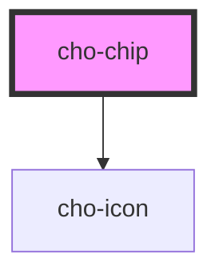

# cho-chip

Chips are compact elements that represent an input, attribute, or action.

## Examples

<style>
  cho-chip {
    margin-right: 0.5rem;
  }
</style>

### Contained

<cho-chip>
  Contained
</cho-chip>

<cho-chip clickable>
  Clickable
</cho-chip>

<cho-chip delete-icon>
  Delete
</cho-chip>

<cho-chip disabled>
  Delete
</cho-chip>

```html
<cho-chip>
  Contained
</cho-chip>

<cho-chip clickable>
  Clickable
</cho-chip>

<cho-chip delete-icon>
  Delete
</cho-chip>

<cho-chip disabled>
  Delete
</cho-chip>
```

### Outlined

<cho-chip kind="outlined">
  Contained
</cho-chip>

<cho-chip kind="outlined" clickable>
  Clickable
</cho-chip>

<cho-chip kind="outlined" delete-icon>
  Delete
</cho-chip>

<cho-chip kind="outlined" disabled>
  Delete
</cho-chip>

```html
<cho-chip kind="outlined">
  Contained
</cho-chip>

<cho-chip kind="outlined" clickable>
  Clickable
</cho-chip>

<cho-chip kind="outlined" delete-icon>
  Delete
</cho-chip>

<cho-chip kind="outlined" disabled>
  Delete
</cho-chip>
```

<!-- Auto Generated Below -->


## Properties

| Property     | Attribute     | Description                                                               | Type                        | Default       |
| ------------ | ------------- | ------------------------------------------------------------------------- | --------------------------- | ------------- |
| `clickable`  | `clickable`   | If `true`, the component will display clicking style.                     | `boolean`                   | `false`       |
| `deleteIcon` | `delete-icon` | If `true`, the component will show the delete icon in the trailing space. | `boolean`                   | `false`       |
| `disabled`   | `disabled`    | If `true`, the button will be disabled.                                   | `boolean`                   | `false`       |
| `kind`       | `kind`        | The kind to use.                                                          | `"contained" \| "outlined"` | `'contained'` |


## Events

| Event    | Description                                     | Type                                  |
| -------- | ----------------------------------------------- | ------------------------------------- |
| `delete` | Callback fired when the delete icon is clicked. | `CustomEvent<IChipDeleteEventDetail>` |


## Slots

| Slot         | Description                                        |
| ------------ | -------------------------------------------------- |
|              | The primary content of the chip.                   |
| `"leading"`  | A component to display before the primary content. |
| `"trailing"` | A component to display after the primary content.  |


## Dependencies

### Depends on

- [cho-icon](../icon)

### Graph


----------------------------------------------

*Built with [StencilJS](https://stenciljs.com/)*
