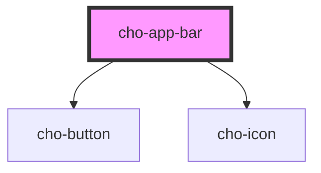

# cho-app-bar

<!-- Auto Generated Below -->

## Properties

| Property        | Attribute         | Description                                                     | Type                   | Default    |
| --------------- | ----------------- | --------------------------------------------------------------- | ---------------------- | ---------- |
| `hidesOnScroll` | `hides-on-scroll` | If `true`, hides on scroll down to leave more space for reading | `boolean`              | `false`    |
| `position`      | `position`        | The position of the app bar.                                    | `"static" \| "sticky"` | `'static'` |

## Events

| Event              | Description                                        | Type                                         |
| ------------------ | -------------------------------------------------- | -------------------------------------------- |
| `hamburgerClicked` | Callback fired when clicking the hamburger button. | `CustomEvent<IAppBarHamburgerClickedDetail>` |

## Slots

| Slot         | Description                                        |
| ------------ | -------------------------------------------------- |
| `"leading"`  | A component to display before the primary content. |
| `"title"`    | The title content of the app bar.                  |
| `"trailing"` | A component to display after the primary content.  |

## Dependencies

### Depends on

- [cho-button](../button)
- [cho-icon](../icon)

### Graph

----------------------------------------------

*Built with [StencilJS](https://stenciljs.com/)*
