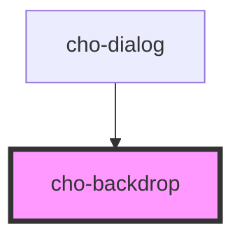

# cho-backdrop

The backdrop component is used to provide emphasis on a particular element or parts of it.

## Examples

```html
<cho-button onclick="document.getElementById('demo-1-backdrop').visible = true"> Show </cho-button>
<cho-backdrop
  onclick="event.target.visible = false;"
  id="demo-1-backdrop"
  style="position: fixed; z-index: 1;"
>
</cho-backdrop>
```

<!-- Auto Generated Below -->


## Properties

| Property  | Attribute | Description                                                | Type      | Default |
| --------- | --------- | ---------------------------------------------------------- | --------- | ------- |
| `visible` | `visible` | If `true`, the backdrop and it's children will be visible. | `boolean` | `false` |


## Slots

| Slot | Description                       |
| ---- | --------------------------------- |
|      | The main content of the backdrop. |


## Dependencies

### Used by

 - [cho-dialog](../dialog)

### Graph


----------------------------------------------

*Built with [StencilJS](https://stenciljs.com/)*
