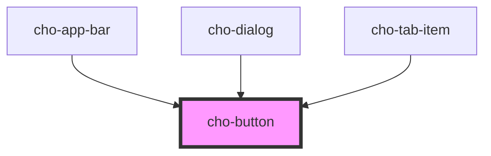

# cho-button

Buttons allow users to take actions, and make choices, with a single tap.

## Examples

### Contained

```html
<cho-button>Contained</cho-button>

<cho-button disabled>Contained</cho-button>
```

### Contained Leading

```html
<cho-button>
  <span slot="leading">+</span>
  <span>Add</span>
</cho-button>
```

### Contained Trailing

```html
<cho-button>
  <span>Add</span>
  <span slot="trailing">+</span>
</cho-button>
```

### Outlined

```html
<cho-button kind="outlined">
  Outlined
</cho-button>

<cho-button kind="outlined" disabled>
  Disabled
</cho-button>
```

### Text

```html
<cho-button kind="text">
  Text
</cho-button>

<cho-button kind="text" disabled>
  Text
</cho-button>
```

<!-- Auto Generated Below -->


## Properties

| Property   | Attribute  | Description                             | Type                                  | Default       |
| ---------- | ---------- | --------------------------------------- | ------------------------------------- | ------------- |
| `disabled` | `disabled` | If `true`, the button will be disabled. | `boolean`                             | `false`       |
| `kind`     | `kind`     | The kind to use.                        | `"contained" \| "outlined" \| "text"` | `'contained'` |


## Slots

| Slot         | Description                                        |
| ------------ | -------------------------------------------------- |
|              | The primary content of the button.                 |
| `"leading"`  | A component to display before the primary content. |
| `"trailing"` | A component to display after the primary content.  |


## Dependencies

### Used by

 - [cho-app-bar](../app-bar)
 - [cho-dialog](../dialog)
 - [cho-tab-item](../tab-item)

### Graph


----------------------------------------------

*Built with [StencilJS](https://stenciljs.com/)*
