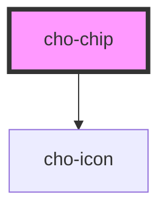

# cho-chip

<!-- Auto Generated Below -->

## Properties

| Property     | Attribute     | Description                                                               | Type                        | Default       |
| ------------ | ------------- | ------------------------------------------------------------------------- | --------------------------- | ------------- |
| `clickable`  | `clickable`   | If `true`, the component will display clicking style.                     | `boolean`                   | `false`       |
| `deleteIcon` | `delete-icon` | If `true`, the component will show the delete icon in the trailing space. | `boolean`                   | `false`       |
| `disabled`   | `disabled`    | If `true`, the button will be disabled.                                   | `boolean`                   | `false`       |
| `kind`       | `kind`        | The kind to use.                                                          | `"contained" \| "outlined"` | `'contained'` |

## Events

| Event    | Description                                     | Type                                  |
| -------- | ----------------------------------------------- | ------------------------------------- |
| `delete` | Callback fired when the delete icon is clicked. | `CustomEvent<IChipDeleteEventDetail>` |

## Slots

| Slot         | Description                                        |
| ------------ | -------------------------------------------------- |
|              | The primary content of the chip.                   |
| `"leading"`  | A component to display before the primary content. |
| `"trailing"` | A component to display after the primary content.  |

## Dependencies

### Depends on

- [cho-icon](../icon)

### Graph

----------------------------------------------

*Built with [StencilJS](https://stenciljs.com/)*
