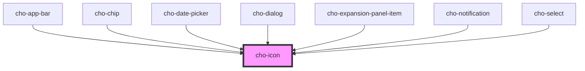

# cho-icon

<!-- Auto Generated Below -->

## Properties

| Property            | Attribute | Description       | Type                                                                                                                                                | Default               |
| ------------------- | --------- | ----------------- | --------------------------------------------------------------------------------------------------------------------------------------------------- | --------------------- |
| `color`             | `color`   | The color to use. | `string`                                                                                                                                            | `'var(--text-color)'` |
| `kind` _(required)_ | `kind`    | The kind to use.  | `"arrow-down" \| "arrow-up" \| "calendar" \| "cancel" \| "close" \| "error-outline" \| "hamburger" \| "info" \| "search" \| "success" \| "warning"` | `undefined`           |

## Dependencies

### Used by

 - [cho-app-bar](../../surfaces/app-bar)
 - [cho-chip](../chip)
 - [cho-date-picker](../../inputs/date-picker)
 - [cho-dialog](../../feedback/dialog)
 - [cho-expansion-panel-item](../../surfaces/expansion-panel-item)
 - [cho-notification](../../feedback/notification)
 - [cho-select](../../inputs/select)

### Graph

----------------------------------------------

*Built with [StencilJS](https://stenciljs.com/)*
