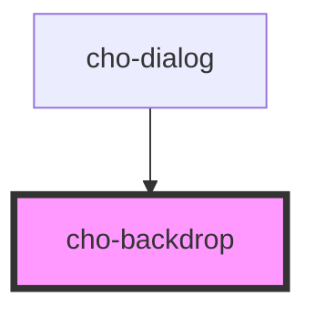

# cho-backdrop

<!-- Auto Generated Below -->

## Properties

| Property  | Attribute | Description                                                | Type      | Default |
| --------- | --------- | ---------------------------------------------------------- | --------- | ------- |
| `visible` | `visible` | If `true`, the backdrop and it's children will be visible. | `boolean` | `false` |

## Slots

| Slot | Description                       |
| ---- | --------------------------------- |
|      | The main content of the backdrop. |

## Dependencies

### Used by

 - [cho-dialog](../dialog)

### Graph

----------------------------------------------

*Built with [StencilJS](https://stenciljs.com/)*
