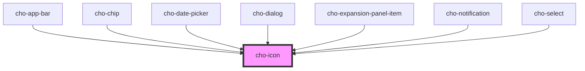

# cho-icon

<!-- Auto Generated Below -->

## Properties

| Property            | Attribute | Description       | Type                                                                                                                                                          | Default               |
| ------------------- | --------- | ----------------- | ------------------------------------------------------------------------------------------------------------------------------------------------------------- | --------------------- |
| `color`             | `color`   | The color to use. | `string`                                                                                                                                                      | `'var(--text-color)'` |
| `kind` _(required)_ | `kind`    | The kind to use.  | `"arrow-down" \| "arrow-up" \| "calendar" \| "cancel" \| "close" \| "error-outline" \| "hamburger" \| "info" \| "link" \| "search" \| "success" \| "warning"` | `undefined`           |

## Dependencies

### Used by

 - [cho-app-bar](../app-bar)
 - [cho-chip](../chip)
 - [cho-date-picker](../date-picker)
 - [cho-dialog](../dialog)
 - [cho-expansion-panel-item](../expansion-panel-item)
 - [cho-notification](../notification)
 - [cho-select](../select)

### Graph

----------------------------------------------

*Built with [StencilJS](https://stenciljs.com/)*
