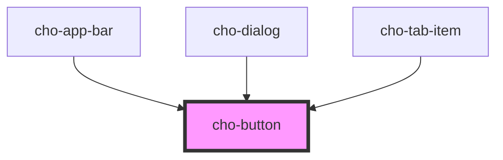

# cho-button

<!-- Auto Generated Below -->

## Properties

| Property   | Attribute  | Description                             | Type                                  | Default       |
| ---------- | ---------- | --------------------------------------- | ------------------------------------- | ------------- |
| `disabled` | `disabled` | If `true`, the button will be disabled. | `boolean`                             | `false`       |
| `kind`     | `kind`     | The kind to use.                        | `"contained" \| "outlined" \| "text"` | `'contained'` |

## Slots

| Slot         | Description                                        |
| ------------ | -------------------------------------------------- |
|              | The primary content of the button.                 |
| `"leading"`  | A component to display before the primary content. |
| `"trailing"` | A component to display after the primary content.  |

## Dependencies

### Used by

 - [cho-app-bar](../../surfaces/app-bar)
 - [cho-dialog](../../feedback/dialog)
 - [cho-tab-item](../../navigation/tab-item)

### Graph

----------------------------------------------

*Built with [StencilJS](https://stenciljs.com/)*
