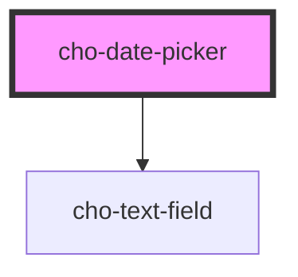

# cho-date-picker

<!-- Auto Generated Below -->

## Properties

| Property            | Attribute  | Description                                 | Type                              | Default                  |
| ------------------- | ---------- | ------------------------------------------- | --------------------------------- | ------------------------ |
| `disabled`          | `disabled` | If `true`, the text-field will be disabled. | `boolean`                         | `false`                  |
| `maxDate`           | --         | Max selectable date                         | `Date`                            | `new Date('2097-01-14')` |
| `minDate`           | --         | Min selectable date                         | `Date`                            | `new Date('1897-01-14')` |
| `shouldDisableDate` | --         | Callback used to disable specific dates.    | `(timestamp?: number) => boolean` | `() => false`            |
| `value`             | --         | The value of the date-picker.               | `Date`                            | `new Date()`             |

## Events

| Event          | Description                               | Type                                         |
| -------------- | ----------------------------------------- | -------------------------------------------- |
| `dayChanged`   | Callback fired when the day is changed.   | `CustomEvent<IDatePickerDayChangedDetail>`   |
| `monthChanged` | Callback fired when the month is changed. | `CustomEvent<IDatePickerMonthChangedDetail>` |
| `valueChanged` | Callback fired when the value is changed. | `CustomEvent<IDatePickerValueChangedDetail>` |
| `yearChanged`  | Callback fired when the year is changed.  | `CustomEvent<IDatePickerYearChangedDetail>`  |

## Dependencies

### Depends on

- [cho-text-field](../text-field)

### Graph

----------------------------------------------

*Built with [StencilJS](https://stenciljs.com/)*
