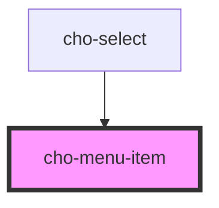

# cho-menu-item

<!-- Auto Generated Below -->

## Properties

| Property   | Attribute  | Description                                | Type      | Default     |
| ---------- | ---------- | ------------------------------------------ | --------- | ----------- |
| `disabled` | `disabled` | If `true`, the menu-item will be disabled. | `boolean` | `false`     |
| `selected` | `selected` | If `true`, the menu-item will be selected. | `boolean` | `false`     |
| `value`    | `value`    | The value of the menu-item.                | `any`     | `undefined` |

## Slots

| Slot | Description                           |
| ---- | ------------------------------------- |
|      | The primary content of the menu-item. |

## Dependencies

### Used by

 - [cho-select](../select)

### Graph

----------------------------------------------

*Built with [StencilJS](https://stenciljs.com/)*
