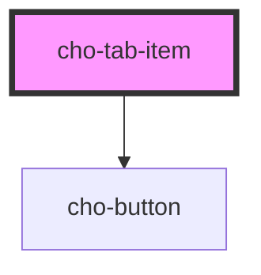

# cho-tab-item

<!-- Auto Generated Below -->

## Properties

| Property             | Attribute  | Description                                    | Type      | Default     |
| -------------------- | ---------- | ---------------------------------------------- | --------- | ----------- |
| `disabled`           | `disabled` | If `true`, the button will be disabled.        | `boolean` | `false`     |
| `index` _(required)_ | `index`    | The position index of the tab.                 | `number`  | `undefined` |
| `label` _(required)_ | `label`    | The label content.                             | `string`  | `undefined` |
| `selected`           | `selected` | If `true`, the tab item will display selected. | `boolean` | `false`     |

## Events

| Event              | Description                                              | Type                                   |
| ------------------ | -------------------------------------------------------- | -------------------------------------- |
| `tabItemConnected` | Called every time the component is connected to the DOM. | `CustomEvent<ITabItemConnectedDetail>` |
| `tabItemSelected`  | Callback fired when the tab item is selected.            | `CustomEvent<ITabItemSelectedDetail>`  |

## Dependencies

### Depends on

- [cho-button](../../inputs/button)

### Graph

----------------------------------------------

*Built with [StencilJS](https://stenciljs.com/)*
