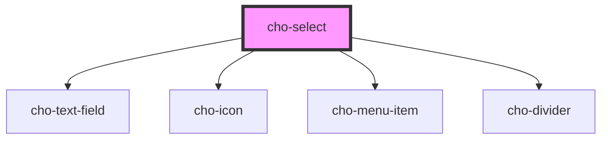

# cho-select

Select components are used for collecting user provided information from a list of options.

## Examples

```html
<cho-select>
  <cho-menu-item-group>
    <cho-menu-item value="1">Option 1</cho-menu-item>
    <cho-menu-item value="2">Option 2</cho-menu-item>
  </cho-menu-item-group>
  <cho-divider></cho-divider>
  <cho-menu-item-group>
    <cho-menu-item value="3">Option 3</cho-menu-item>
    <cho-menu-item value="4">Option 4</cho-menu-item>
  </cho-menu-item-group>
</cho-select>
```


<!-- Auto Generated Below -->


## Properties

| Property   | Attribute  | Description                                               | Type      | Default     |
| ---------- | ---------- | --------------------------------------------------------- | --------- | ----------- |
| `disabled` | `disabled` | If `true`, the text-field will be disabled.               | `boolean` | `false`     |
| `error`    | `error`    | If `true`, the label will be displayed in an error state. | `boolean` | `false`     |
| `label`    | `label`    | The label content.                                        | `string`  | `undefined` |
| `value`    | `value`    | The value of the select.                                  | `any`     | `null`      |
| `visible`  | `visible`  | If `true`, the dropdown will be visible.                  | `boolean` | `false`     |


## Events

| Event          | Description                               | Type                                     |
| -------------- | ----------------------------------------- | ---------------------------------------- |
| `valueChanged` | Callback fired when the value is changed. | `CustomEvent<ISelectValueChangedDetail>` |


## Methods

### `close() => Promise<void>`

Close the dropdown.

#### Returns

Type: `Promise<void>`


### `open() => Promise<void>`

Open the dropdown.

#### Returns

Type: `Promise<void>`


### `reset() => Promise<void>`

Reset the select to its initial state.

#### Returns

Type: `Promise<void>`


## Slots

| Slot | Description                                                                     |
| ---- | ------------------------------------------------------------------------------- |
|      | The primary content of the select. (i.e. menu-item-group, menu-item or divider) |


## Dependencies

### Depends on

- [cho-text-field](../text-field)
- [cho-icon](../icon)
- [cho-menu-item](../menu-item)
- [cho-divider](../divider)

### Graph


----------------------------------------------

*Built with [StencilJS](https://stenciljs.com/)*
