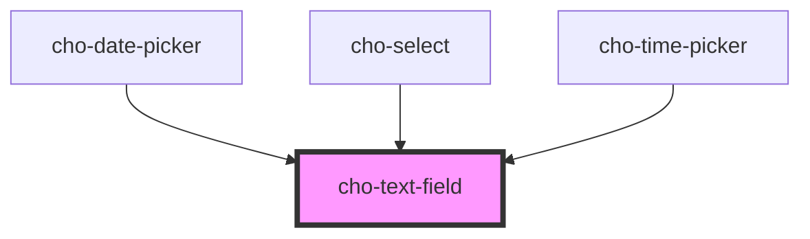

# cho-text-field

Text fields let users enter and edit text.

## Examples

### Error

<cho-text-field label="Error" value="Hello World" helper-text="Incorrect entry" error>
</cho-text-field>

```html
<cho-text-field label="Error" value="Hello World" helper-text="Incorrect entry" error>
</cho-text-field>
```

### Leading

<cho-text-field label="Amount" type="number" value="100" placeholder="Enter amount">
  <span slot="leading">$</span>
</cho-text-field>

```html
<cho-text-field label="Amount" type="number" value="100" placeholder="Enter amount">
  <span slot="leading">$</span>
</cho-text-field>
```

### Trailing

<cho-text-field label="Email" type="email" style="width: 26ch;">
  <span slot="trailing" style="white-space: nowrap;">@mail.com</span>
</cho-text-field>

```html
<cho-text-field label="Email" type="email" style="width: 26ch;">
  <span slot="trailing" style="white-space: nowrap;">@mail.com</span>
</cho-text-field>
```

### Read Only

<cho-text-field label="Read Only" value="Hello World" read-only>
</cho-text-field>

```html
<cho-text-field label="Read Only" value="Hello World" read-only>
</cho-text-field>
```

### Textarea

<cho-text-field label="Textarea" placeholder="Multiline..." rows="5" multiline>
</cho-text-field>

```html
<cho-text-field label="Textarea" placeholder="Multiline..." rows="5" multiline>
</cho-text-field>
```

<!-- Auto Generated Below -->


## Properties

| Property      | Attribute     | Description                                                                                      | Type                                                                                              | Default     |
| ------------- | ------------- | ------------------------------------------------------------------------------------------------ | ------------------------------------------------------------------------------------------------- | ----------- |
| `disabled`    | `disabled`    | If `true`, the text-field will be disabled.                                                      | `boolean`                                                                                         | `false`     |
| `error`       | `error`       | If `true`, the label will be displayed in an error state.                                        | `boolean`                                                                                         | `false`     |
| `helperText`  | `helper-text` | The helper text content.                                                                         | `string`                                                                                          | `undefined` |
| `label`       | `label`       | The label content.                                                                               | `string`                                                                                          | `undefined` |
| `max`         | `max`         | The maximum allowed value of the input. Should not be equal to min.                              | `number`                                                                                          | `100`       |
| `min`         | `min`         | The minimum allowed value of the input. Should not be equal to max.                              | `number`                                                                                          | `0`         |
| `multiline`   | `multiline`   | If `true`, a textarea element will be rendered instead of an input.                              | `boolean`                                                                                         | `false`     |
| `name`        | `name`        | Name attribute of the input element.                                                             | `string`                                                                                          | `undefined` |
| `placeholder` | `placeholder` | The short hint displayed in the input before the user enters a value.                            | `string`                                                                                          | `undefined` |
| `readOnly`    | `read-only`   | It prevents the user from changing the value of the field (not from interacting with the field). | `boolean`                                                                                         | `false`     |
| `rows`        | `rows`        | Number of rows to display when `multiline` option is set to true.                                | `number`                                                                                          | `2`         |
| `step`        | `step`        | The granularity with which the input can step through values.                                    | `number \| string`                                                                                | `'any'`     |
| `textAlign`   | `text-align`  | Set the text alignment inside the input element.                                                 | `"center" \| "end" \| "justify" \| "left" \| "match-parent" \| "right" \| "start"`                | `undefined` |
| `type`        | `type`        | Specifies the type of <input> element to display.                                                | `"date" \| "email" \| "hidden" \| "number" \| "password" \| "search" \| "tel" \| "text" \| "url"` | `'text'`    |
| `value`       | `value`       | The value of the input element, required for a controlled component.                             | `string`                                                                                          | `undefined` |


## Events

| Event          | Description                               | Type                                        |
| -------------- | ----------------------------------------- | ------------------------------------------- |
| `valueChanged` | Callback fired when the value is changed. | `CustomEvent<ITextFieldValueChangedDetail>` |


## Slots

| Slot         | Description                                        |
| ------------ | -------------------------------------------------- |
| `"leading"`  | A component to display before the primary content. |
| `"trailing"` | A component to display after the primary content.  |


## Dependencies

### Used by

 - [cho-date-picker](../date-picker)
 - [cho-select](../select)
 - [cho-time-picker](../time-picker)

### Graph


----------------------------------------------

*Built with [StencilJS](https://stenciljs.com/)*
